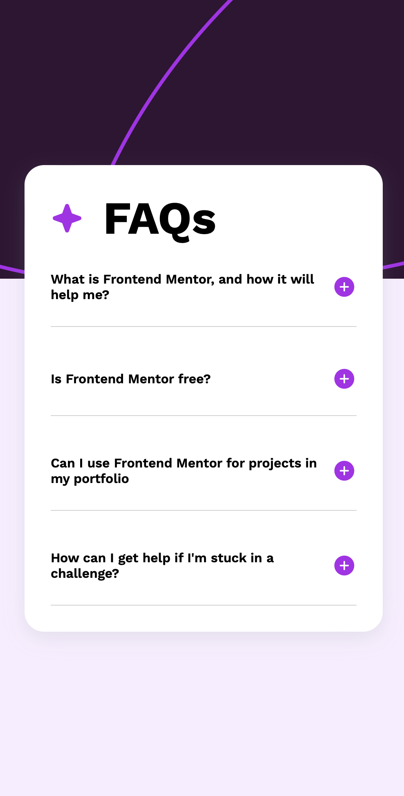

# Frontend Mentor - FAQ accordion solution

This is a solution to the [FAQ accordion challenge on Frontend Mentor](https://www.frontendmentor.io/challenges/faq-accordion-wyfFdeBwBz). Frontend Mentor challenges help you improve your coding skills by building realistic projects. 

## Table of contents

- [Overview](#overview)
  - [The challenge](#the-challenge)
  - [Screenshot](#screenshot)
  - [Links](#links)
- [My process](#my-process)
  - [Built with](#built-with)
  - [What I learned](#what-i-learned)
  - [Continued development](#continued-development)
  - [Useful resources](#useful-resources)
- [Author](#author)
- [Acknowledgments](#acknowledgments)


Users should be able to:

- Hide/Show the answer to a question when the question is clicked
- Navigate the questions and hide/show answers using keyboard navigation alone
- View the optimal layout for the interface depending on their device's screen size
- See hover and focus states for all interactive elements on the page

### Screenshot




Add a screenshot of your solution. The easiest way to do this is to use Firefox to view your project, right-click the page and select "Take a Screenshot". You can choose either a full-height screenshot or a cropped one based on how long the page is. If it's very long, it might be best to crop it.

Alternatively, you can use a tool like [FireShot](https://getfireshot.com/) to take the screenshot. FireShot has a free option, so you don't need to purchase it. 

Then crop/optimize/edit your image however you like, add it to your project, and update the file path in the image above.

**Note: Delete this note and the paragraphs above when you add your screenshot. If you prefer not to add a screenshot, feel free to remove this entire section.**

### Links

- Solution URL: (https://github.com/Peteonthebeat/FAQ-Accordion-Challenge.git)
- Live Site URL: (https://peteonthebeat.github.io/FAQ-Accordion-Challenge/)


### Built with

- Semantic HTML5 markup
- CSS custom properties
- Flexbox
— JavaScript

### What I learned

Query selectors and identifying each element and its style or property in the DOM 


<!-- HTML -->
```
  <div class="questions">
   <!-- QUESTION 1 -->
   <div class="questions-and-answers">
  <div class="question-wrapper">
    <div class="button" id="questionOne">
     What is Frontend Mentor, and how it will help me?
    </div>
    
  </div>
    <!-- ANSWER 1 -->
  <article class="answer answerOne" id="answerOne">
    Frontend Mentor offers realistic coding challenges to help developers improve
    their front end coding skills with projects in HTML, CSS, and JavaScript.
    It is suitable for all levels and ideal for portfolio building.
   </article>
  </div>
```
<!-- CSS -->
  ```
.questions {
    display: flex;
    flex-direction: column;
    justify-content: center;
    align-items: flex-start;
    font-weight: 600;
    gap: 3rem;
}

.question-wrapper {
    display: flex;
    flex-direction: row;
    justify-content: space-between; 
    align-items: center;
    position: relative;
    padding: 0 0 30px 0;
    gap: 0 3rem;
    /* border-bottom: solid lightgrey 1px; */
}

.question-wrapper::before {
    content: '';
    position: absolute;
    bottom: 0; 
    left: 0;
    height: 1px;
    width: 100%;
    background-color: lightgray
    
    /* border-bottom: solid rgb(248, 4, 4) 1px; */
  }
  ```
 ```

  <!-- JS -->
  let questionOne = document.querySelector('#questionOne'); 
questionOne.addEventListener('click', function onClick(event){
            let answerOneElement = document.querySelector('#answerOne'); 
            let answerOneDisplay = answerOneElement.style.display;
            let iconOneElement = document.querySelector('#iconOne'); 

            //  FUNCTION ONE
            if (answerOneDisplay === 'none'){
                answerOneElement.style.display = 'block'; 
                iconOneElement.setAttribute('src', '/assets/images/icon-minus.svg'); 
            }   else {
                answerOneElement.style.display = 'none'; 
                iconOneElement.setAttribute('src', '/assets/images/icon-plus.svg')
            }
}); 
  ``


### Continued development
I plan to re-do this challenge using reusable classes and arrow function(s)


### Useful resources
Codecademy, FCC

## Author

- Website - [POTB](youtube.com/@potbtech)
- Frontend Mentor - [@peteonthebeat](https://github.com/Peteonthebeat)


## Acknowledgments

My girl — with the 'before' element. he
